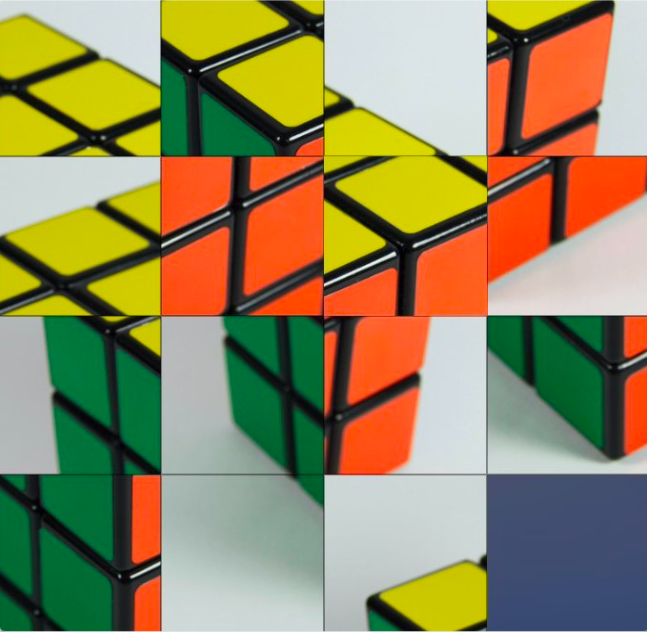
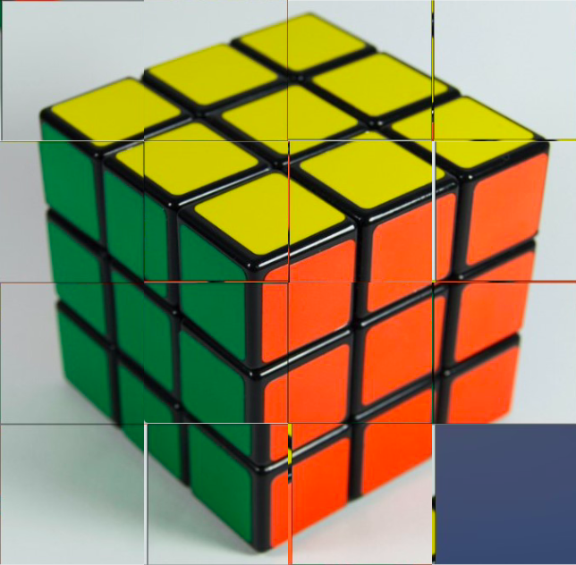
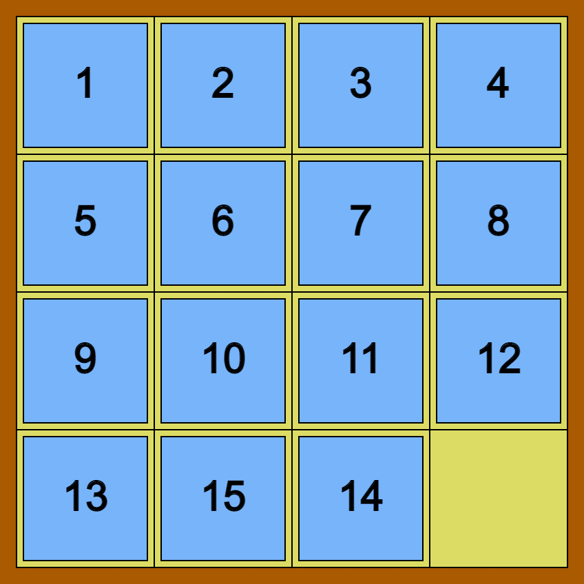

# OpenCV Cube Solving

Solving a Rubik's cube by using the 15 puzzle problem, using branch-and-bound algorithm for solving and OpenCV for image matching.

## Cube Solving

    
    

## 15 puzzle

    </img>  
    <a href="https://prove-me-wrong.com/2021/09/12/the-15-puzzle-and-the-symmetric-group/">Image Source</a>

